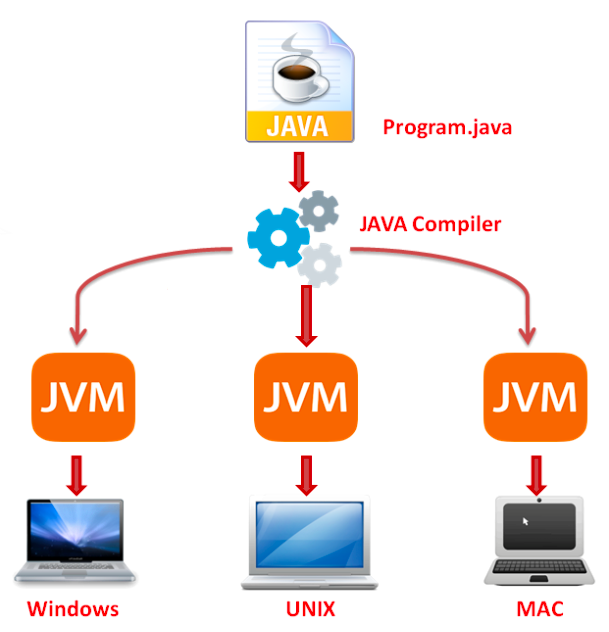
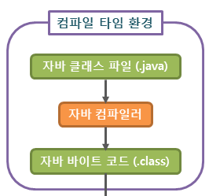
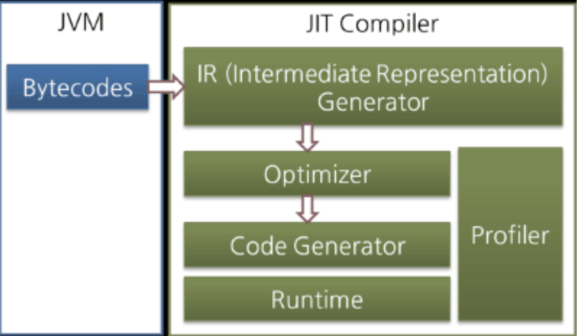
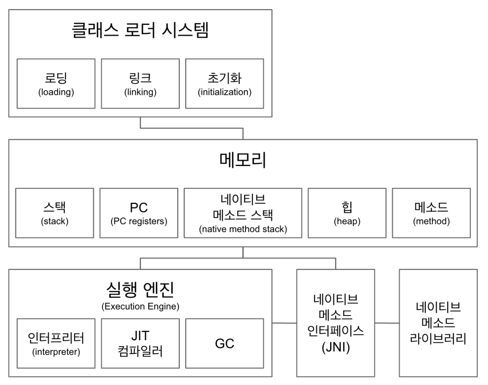
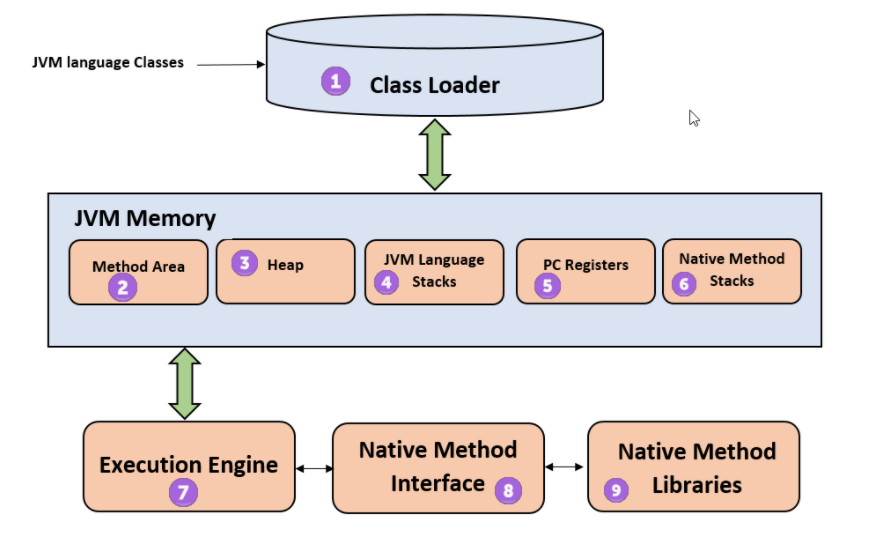
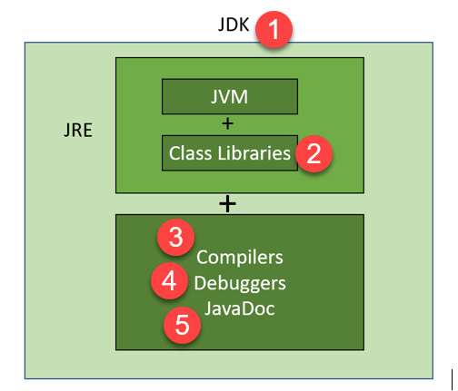

### JVM이란 무엇인가

Java Virtual Machine

- 
- 자바 컴파일러는 .java 파일을 .class 파일인 바이트코드로 변환

  > 자바 프로그램(.java 파일)을 바로 실행 할 수는 없는 것 일까요?
  >

  네, 없습니다. 컴퓨터가 이해 할 수 있는 언어는 기계어로 0과 1로 이루어진 바이너리 코드인데, 자바 프로그램(컴파일 된)은 바이트코드(가상 머신이 이해할 수 있는 코드)로 되어 있기 때문입니다.

- JVM은 OS가 바이트코드를 이해할 수 있도록 해석해 주는 역할을 함
- JVM만 설치 되어 있으면 윈도우든 리눅스든 OS에 종속적이지 않고 자바 코드를 실행 할 수 있음

### 컴파일 하는 방법

`javac` 명령어를 통해 .java 파일에서 .class 파일 생성

ex)

    ```java
    javac Hello.java
    ```

### 실행하는 방법

`java` 명령어를 통해 .class 파일 실행

ex)

    ```java
    java Hello.class
    ```

JVM의 구성요소인 클래스로더가 Hello.class 파일을 메모리상의 JVM으로 가져온다.

classLoader → byteCode Verifier (바이트코드 변조 확인) → Execution Engine 에서 실행되는 구조
Execution Engine 에서 .class 파일(바이트코드로 구성)을 기계어로 변경해서 명령어 단위로 실행

- `Interpreter 방식` 명령어를 하나씩 수행 하는 방식
- `JIT(Just In Time compiler) 방식` 전체 바이트코드를 네이티브 코드로 변환하고 그 이후에는 네이티브 코드로 실행하는 방식

### 바이트코드란 무엇인가

JVM이 이해할 수 있는 언어로 변환된 자바 소스 코드

자바 컴파일러로 변환되는 코드의 명령어 크기가 1바이트라서 바이트코드라고 불린다고 한다.



### JIT 컴파일러란 무엇이며 어떻게 동작하는지

기존 클래스파일(바이트코드)를 실행하는 방법 = `Interpreter 방식`

→ Interpreter 방식은 명령어를 하나씩 해석해서 처리하는 개념
명령어 하나하나 실행하는 속도는 빠를지 모르나 전체 코드 관점에서 보면 실행 속도가 느린 단점이 있다.

해당 문제를 해결하기 위해서 나온 방법 = `JIT 컴파일러`

→ **JIT 컴파일러는 런타임 시 클래스파일(바이트코드)를 네이티브 기계어로 ~~한방에~~ 컴파일 후 사용하는 개념**

- JIT 컴파일러 내부구조
  
  JIT 컴파일러는 바이트코드를 일단 중간 단계의 표현인 IR(Intermediate Representation)로 변환하여 최적화를 수행하고 그 다음에 네이티브 코드를 생성한다.

### JVM 구성 요소


1. **Class Loader:** 클래스 로더는 클래스 파일을 로드하는 데 사용되는 하위 시스템이다.
2. **Method Area:** JVM Method Area는 메타데이터, 상수 런타임 풀, 메서드에 대한 코드와 같은 클래스 구조를 저장한다. 공유자원(여기서 공유자원이라는 의미는 다른 스레드에서도 활용 가능한 자원을 말함)이다.
3. **Heap:** 모든 개체, 관련 인스턴스 변수 및 배열은 힙에 저장된다. 이 메모리는 여러 스레드에 걸쳐 공유된다.
4. **JVM Language Stacks:** Java Language Stacks는 로컬 변수를 저장하고 부분적인 결과를 얻는다.각 스레드에는 자체 JVM 스택이 있으며, 스레드가 생성될 때 동시에 생성된다.메서드를 호출할 때마다 새 프레임이 생성되고, 메서드 호출 프로세스가 완료되면 삭제된다. 스택은 공유자원이 아니므로 스레드 세이프(여러 스레드에서 공용 자원을 접근할 때 생길 수 있는 문제) 하다. 내부에는 Local Variable Array, Operand Stack, Frame Data의 영역이 있다.
5. **PC Register:** PC 레지스터는 현재 실행 중인 Java 가상 시스템 명령의 주소를 저장한다. 자바에서는 각 스레드에 별도의 PC 레지스터가 있다.
6. **Native Method Stack:** 네이티브 메서드 스택은 네이티브 라이브러리에 따라 네이티브 코드 명령을 관리한다. 자바 대신 다른 언어로 쓰여 있다.
7. **Execution Engine:** 런타임 데이터 영역에 할당 된 바이트코드는 실행 엔진에 의해 실행된다.실행 엔진은 바이트코드를 읽고 조각 별로 실행한다.
8. **Native Method Interface:** Native Method Interface는 프로그래밍 프레임워크다. JVM에서 실행 중인 Java 코드가 라이브러리 및 네이티브 애플리케이션으로 호출할 수 있도록 한다.
9. **Native Method Libraries:** Native Libraries는 실행 엔진에 필요한 Native Libraries(C, C++)의 모음이다.

### JDK와 JRE의 차이


`JDK`
Java Development Kit :: JRE + 개발에 필요한 SW를 모아 놓은 좀 더 큰 범위의 SW
Oracle Java 11 부터는 기본적으로 JRE를 포함하고 있으며 개발에 필요한 여러 가지 툴을 제공

`JRE`
Java Runtime Environment :: 자바 어플리케이션을 수행하기 위한 SW(JVM과 클래스 라이브러리 등 최소한의 환경)